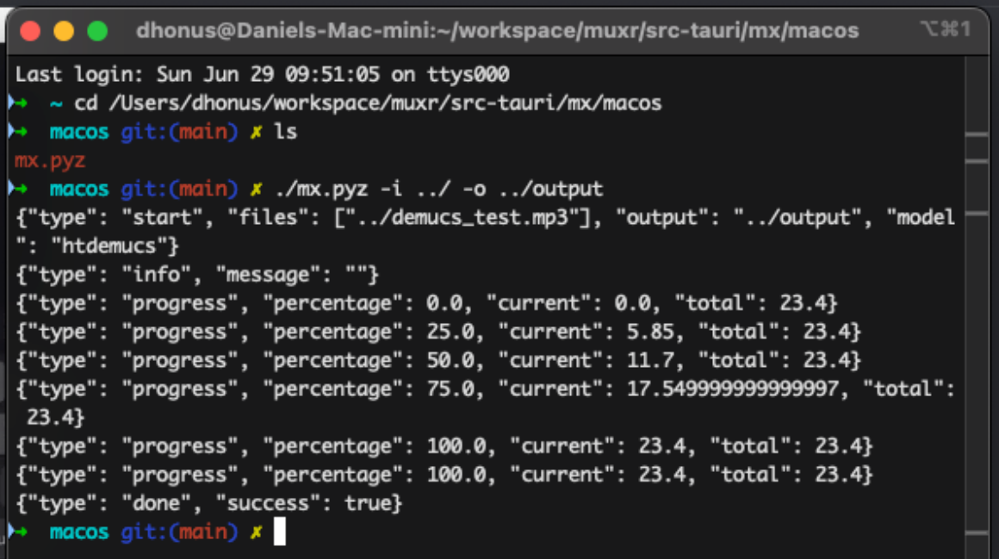

import Callout from '@/components/Callout.astro';

## Muxr

I built [muxr](https://github.com/fjenda/muxr) as a local, self-hosted alternative to various online audio stem separation services. The purpose of such a tool
is the ability to turn a full piece of music into individual instrument tracks, allowing you to better analyze them and use them in learning an instrument for example.

The original goal for this project was a standalone application using the Tauri framework. In practice, however, the deployment of a full python runtime
and ML model in a single binary was not feasible. This case study focuses on the backend and deployment architecture decisions that followed,
including why I abandoned the desktop-first approach in favor of an API based web application.

<Callout title="Scope & Attribution" variant="note">
This case study focuses on backend architecture and deployment decisions. The frontend was implemented **by a collaborator**. I defined the workflow, gave technical guidance, fixed some styling issues, added linting and basic project hygiene, and handled Dockerization. I didn’t own the UI/UX design end-to-end.
</Callout>

## Initial prototype
The project started as a simple experiment: I wanted a locally run desktop app for audio stem separation. So I began by writing a minimal python wrapper around [hybrid transformer demucs](https://github.com/facebookresearch/demucs), a very high quality model by Meta Research. At this stage, the goal was relatively modest.
I wanted to make sure that I could invoke and control the model, extract progress information and expose the controls in a way that the user interface could control.

The prototype itself worked very well, the inference speed was also quite good on my mid-range laptop (with an integrated GPU no less). The real problems only started to appear after I tried to embed this script into something that could be widely distributed to other machines.

My hard requirement for the final product was that it should be very **easy to deploy and run** for an end user (and myself). This meant:
* no runtime Python dependency for the end user
* no virtualenv management on the target machine
* progress reporting (percentages) exposed to rust / UI
* fully buildable via CI (Github actions)
* ideally cross-platform (linux/windows/macos)

This immediately rules out "shell script that runs python" approach, as the user would need to have a working python environment with all dependencies installed.

### What worked: Calling Demucs via CLI
The core of muxr is the invocation of Demucs itself. The model itself is exposed as a command line tool via the `demucs.separate` module. The simplest way to invoke it is like so:
```bash
python3 -m demucs.separate -n hybrid_transformer path/to/audiofile.wav
````

This of course works, but for an application we need more control over the input/output paths, progress reporting, and various model parameters. A more usable python wrapper looks like this:

```python title="muxr/demucs_wrapper.py"
# find all audio files in the input directory and separate them using demucs
import subprocess as sp
from pathlib import Path
import os

extensions = ["mp3", "wav", "ogg", "flac"]
model = "htdemucs"
mp3 = True
mp3_rate = 192
float32 = False
int24 = False

def find_files(directory):
    return [file for file in Path(directory).iterdir() if file.suffix.lower().lstrip(".") in extensions]

def separate(inp, outp):
    os.makedirs(outp, exist_ok=True)

    cmd = ["python3", "-m", "demucs.separate", "-o", str(outp), "-n", model]
    if mp3:
        cmd += ["--mp3", f"--mp3-bitrate={mp3_rate}"]
    if float32:
        cmd += ["--float32"]
    if int24:
        cmd += ["--int24"]

    files = [str(f) for f in find_files(inp)]
    p = sp.Popen(cmd + files, stdout=sp.PIPE, stderr=sp.PIPE)
    p.wait()

separate("path/to/input", "path/to/output")
```
This worked reliably in a normal Python environment. There is almost no coupling, demucs already handles models, output structure, progress bars. So far so good.

### Why desktop packaging failed
The real problems started when I tried to package this script into a standalone application. My working theory was that I could use python packaging tools like PyInstaller or Nuitka to bundle the script and all dependencies into a single executable binary. This would allow users to run the application without needing to install Python or any packages. However, this approach quickly ran into several issues.

Once the script was compiled into a binary, `sys.executable` no longer pointed to python, but pointed to the compiled binary itself.
```bash
cmd = [sys.executable, "-m", "demucs.separate", ...]
# Error, the program tried to call itself with '-m' argument
```
Since I am avoiding relying on a local python runtime, and -m is a python interpreter feature, this rules out subprocess + `-m demucs.separate`.

My next idea was to use demucs as a library. This had to be thrown out quickly, though. Demucs' main() is a CLI wrapper, not a stable callable API. Anything that requires process-level isolation is not feasible to call directly, let alone to package it as such.
* Dynamic imports
* Runtime argument parsing
* Torch + multiprocessing
* sys.exit() inside imported code

All of these issues made it clear that trying to package demucs as a library was not going to work.

#### Bundling with python packaging tools
I tried using PyInstaller, Nuitka and shiv to bundle the entire python runtime and dependencies into a single binary.

##### shiv
Packages Python apps into a single binary .pyz file that includes a virtualenv and embedded interpreter. You still need python installed, but it’s self-contained otherwise. The main issue here is python version management, which breaks the goal of zero-dependency deployment.

##### PyInstaller
This does more work than shiv, it can produce a standalone executable by bundling the Python interpreter and all dependencies. This works well for simple scripts, but demucs depends on complex libraries like PyTorch that have native extensions and dynamic loading, which PyInstaller struggles to handle correctly. The maintenance cost of such a setup would also be astronomical.

##### Nuitka
Compiles Python code to C/C++ executables. While it sounded promising, Nuitka has the exact same problem with `-m` usage as above, since the compiled binary cannot invoke python modules directly.
Simple usage of demucs such as ```subprocess("python -m demucs.separate")``` compiles, but the second I switched to
```python
import demucs.apply
import demucs.audio
import demucs.pretrained
```
the compile times exploded and the resulting binary was huge. Nuitka cannot statically analyze torch dynamic imports any better than PyInstaller.

#### Bundling with ONNX
Another idea I explored was converting the Demucs model to the ONNX format (which is a more portable representation of machine learning models) and run it with an ONNX runtime, like the [onnxruntime](https://docs.rs/onnxruntime/latest/onnxruntime/) crate. I think this is the most promising approach and would indeed likely work if done well, but with 1 major caveat: **demucs is a hybrid time–frequency model**. While the core network operates on spectrogram representations, it relies on a non-trivial STFT-based preprocessing and reconstruction pipeline around it, which makes the surrounding system almost as important as the model itself.

As simple as running the model is, the pre- and post-processing steps (loading audio, chunking, overlap-add, writing output files) are very non-trivial to reimplement correctly.

This includes:
1. Short-Time Fourier Transform (STFT) to convert input audio into a time–frequency representation
2. Normalizing and shaping spectrogram to fit the model's input format
3. Running the inference
4. Converting the output back to time domain via inverse STFT
5. Reconstructing the parts back into audio files
6. Integrate with tauri, ship with github actions, handle edge cases

This is a lot of work, and while I believe it would be possible to reimplement all of this correctly, it would introduce a long-term minefield of bugs and edge cases. More importantly, it would shift the project’s focus from building a deployable tool to maintaining a custom DSP pipeline, so I decided to abandon this approach.

## Pivot to a web API backend
At this point it became clear that the failure mode was not any specific tool, but the assumption that this class of ML workload could be trivially packaged into a desktop binary at all. The core issue was not Demucs, not Python (though truthfully it doesn't make things easy in this case), not even ML packaging necessarily. It was **optimizing fully for a native binary distribution** in a space that is not well suited for it. If the only reliable way to run a dependency is by rewriting significant parts of its pre- and post-processing logic, then the cost-benefit analysis quickly turns negative.

Some ways to reframe this problem:
* instead of asking "how do I hide Python inside a desktop app", ask "what is the convenient way to make Demucs available locally"
* Demucs behaves correctly only when treated as a process, not a library
* process isolation is important and useful here
* the runtime complexity is manageable as long as it stays on the backend and not in the same package as the UI
* a stable deployment is more valuable than a native desktop user interface

Once framed this way, the solution became more obvious. Instead of embedding Demucs, python and user interface into a single binary, it could simply be exposed as an API service. This has several advantages:
* Demucs runs as intended, as an isolated process
* the backend handles all python dependencies and environment management
* the app can be Dockerized and easy to deploy

Of course this comes with tradeoffs:
* no single native desktop binary
* requires running a local server
* complex to manage (self-hosted backend + frontend)

These tradeoffs are reasonable given the constraints of this project and time complexity of packaging the model.

### Final architecture
The final architecture of muxr is a web application with a FastAPI backend and a Svelte frontend. The backend is responsible for:
* managing Demucs invocation as a subprocess, multiple requests at a time are possible
* accepting audio file uploads via HTTP
* reporting progress to the frontend via a simple polling API
* packaging the output stems into a zip file for download

The API itself ended up quite simple, with just 2 endpoints:
* `POST /separate` - accepts an audio file upload (or youtube url), starts a Demucs separation job in the background, returns a session ID
* `GET /result/{session_id}` - checks the status of a separation job, returns progress info or the resulting zip file if done

I chose FastAPI because I was already familiar with it, I have used it in my bachelor thesis, and it is very pleasant to work with. It supports asynchronous request handling, background tasks, and has great documentation.

#### Demo
Here is a short demo of using muxr to separate a music track into stems. UI shown for context; this case study focuses on backend and deployment decisions.
<video controls muted loop>
  <source src="/assets/muxr-showcase.mp4" type="video/mp4" />
  Your browser does not support the video tag.
</video>

#### Implementation details

The script itself is intentionally minimal and only does what is necessary to run Demucs reliably and report progress.
##### Process model and job lifecycle
Each separation request is handled as a background task that spawns a new subprocess running Demucs. Jobs are isolated as separate processes and identified with a randomly generated session ID. This ID is used to track progress and also on disk to store input/output files.

Rather than tracking progress in memory, each job writes its state to its own output directory.
1. `progress.json` - current progress (percentage, messages)
2. `status.txt` - final job status (`success` or `error`)
3. `log.txt` - full stdout/stderr log of the Demucs process
4. `last_poll.txt` - timestamp of the last client poll, used to detect abandoned jobs using a simple heartbeat mechanism
5. `result.zip` - final output zip file containing separated stems

##### Progress extraction and polling

Demucs does not provide a structured API for progress reporting, as we've established - it is a CLI tool. To work around this, I implemented a simple progress extraction mechanism by parsing the stderr output of the Demucs subprocess in real time.

<Callout title="Progress reporting" variant="example" defaultOpen={false}>

Here is the relevant code snippet that extracts progress information from Demucs' stderr output:

```python title="muxr/api/main.py" collapse={13-21,29-40} {11,16}
process = subprocess.Popen(
    cmd, stderr=subprocess.PIPE, stdout=subprocess.PIPE, text=True,
)

for line in process.stderr:
    line = line.strip()
    if not line:
        continue

    # demucs prints progress like: "37%|█████▌ | 1.23M/3.45M ..."
    if "%" in line and "|" in line and "/" in line:
        try:
            percent_str = line.split('%')[0].strip()
            percentage = float(percent_str)

            fraction_part = [part for part in line.split() if "/" in part]
            if fraction_part:
                current, total = fraction_part[0].split('/')
                current = parse_human_size(current)
                total = parse_human_size(total)

                progress_file.write_text(json.dumps({
                    "type": "progress",
                    "percentage": percentage,
                    "current": current,
                    "total": total,
                }))
                continue
        except Exception as e:
            print(f"Error parsing progress line: {line}, error: {e}")

    # fallback info message
    progress_file.write_text(json.dumps({
        "type": "info",
        "message": line,
    }))
```



</Callout>

##### Heartbeat based cleanup
To avoid orphaned jobs consuming resources, a simple heartbeat mechanism is implemented. Each job writes a timestamp to `last_poll.txt` whenever the client polls for progress. A separate watcher thread periodically checks this timestamp. If polling stops for too long, a job is assumed to be abandoned and the subprocess is terminated.

##### Output packaging
Once a job completes successfully, the separated stems are packaged into a zip file for download by the client. This is done using Python's built-in `zipfile` module.

#### Docker
To achieve the goal of easy deployment, the entire application is packaged as a Docker Compose setup with 2 services: `api` and `web`. The API service runs the FastAPI backend, while the web service serves the frontend Svelte application.
### Docker Compose
```yaml title="docker-compose.yml"
version: "3.8"
services:
  api:
    build:
      context: ./api
    restart: unless-stopped

  web:
    build:
      context: ./web
    ports:
      - "5173:5173"
    restart: unless-stopped
```

This setup does not include persistent storage for the API service; job data is ephemeral by default. In a production deployment, you would want to mount a volume to `/app/jobs` inside the `api` container to persist job data across restarts.

### Dockerfiles
The API Dockerfile is relatively straightforward. It uses the official Python slim image, installs necessary system dependencies (git, ffmpeg), installs python dependencies from `requirements.txt`, and copies the application code into the container.
```dockerfile title="api/Dockerfile"
FROM python:3.11-slim

WORKDIR /app

RUN apt-get update && apt-get install -y git ffmpeg && rm -rf /var/lib/apt/lists/*

COPY requirements.txt .
RUN pip install --no-cache-dir -r requirements.txt

COPY . .

CMD ["python", "main.py"]
```

The frontend depends on a locally vendored fork of wavesurfer-multitrack, which is referenced via a `file:` dependency. This required running the Vite dev server once during the image build to ensure the dependency is correctly resolved and styled. While not ideal and something I would like to improve in the future, it works reliably for now.

Otherwise, the Dockerfile is a standard Node.js setup that installs dependencies, builds the wavesurfer-multitrack dependency, and starts the Vite dev server.

```dockerfile title="web/Dockerfile"
FROM node:22-alpine

WORKDIR /app

COPY package*.json ./
RUN npm install

ENV DOCKER=true

COPY . .

RUN cd node_modules/wavesurfer-multitrack && npm install && npm run build
EXPOSE 5173

# warm up local file-based dependency resolution
RUN npm run dev -- --host 0.0.0.0 & sleep 2 && pkill -f vite || true

CMD ["npm", "run", "dev", "--", "--host", "0.0.0.0"]
```
## Conclusion
The goal was never to build a complex bundling mechanism for an ML model, but a simple to deploy and use stem separation tool. Given the constraints of Demucs and Python packaging, the web API approach proved to be the most reliable and maintainable solution. The final result is a self-hosted application that can be easily deployed via Docker, treats Demucs as a black box exposing just enough control to the user and avoids solving packaging problems that would dominate the project without improving its core value.
